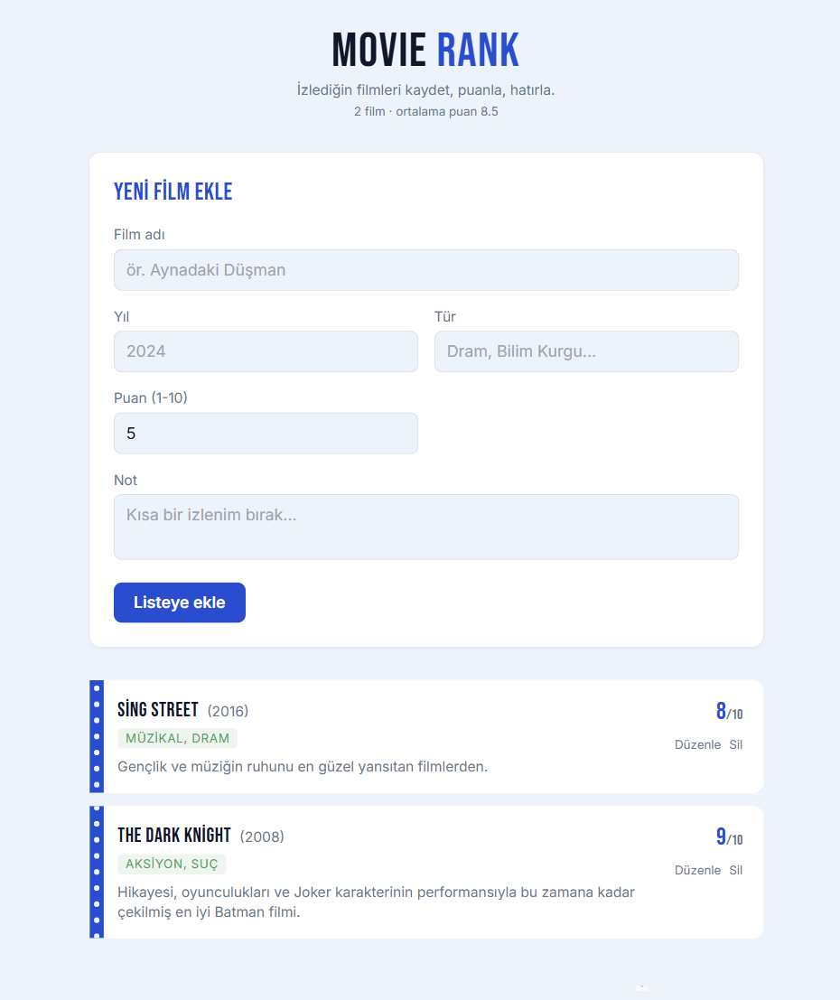

# Movie Rank — Film Günlüğüm

🔗 Canlı demo: https://reel-log.netlify.app

İzlediğin filmleri ekleyip, listeleyip, düzenleyip, silebildiğin küçük bir React uygulaması.
Veriler tarayıcının **localStorage**'ında saklanır, backend yoktur.

## Ekran Görüntüsü



## Kullanılan Teknolojiler

- React 18 + Vite
- Tailwind CSS
- localStorage (CRUD)

## Özellikler (proje gereksinimleri)

- ✅ Ekle
- ✅ Listele
- ✅ Güncelle
- ✅ Sil

## Yerelde Çalıştırma

```bash
npm install
npm run dev
```

Tarayıcıda `http://localhost:5173` adresini aç.

## Production Build

```bash
npm run build
```

Çıktı `dist/` klasörüne yazılır.

## Deploy (Netlify)

1. https://app.netlify.com adresine git, GitHub ile giriş yap.
2. "Add new site" → "Import an existing project" → bu repo'yu seç.
3. Build command: `npm run build`, Publish directory: `dist`
4. Deploy'a bas, linki al.

(Alternatif: `npm run build` sonrası oluşan `dist` klasörünü Netlify'ın
"Deploys" sekmesine sürükle-bırak yapabilirsin — repo bağlamadan da olur.)
